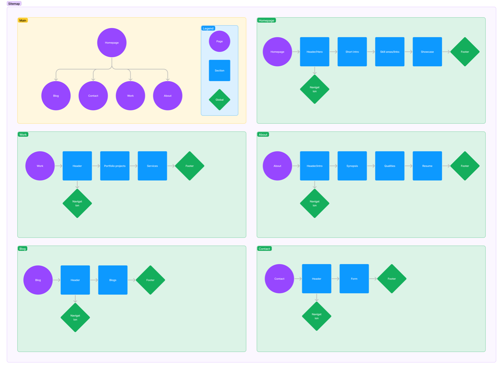

<section class="sectionWrapper">

## Introduction

This week, I began and worked through the ideation and research phases of my project. I used the online project management tool Asana to organize the phases of the project.

 The project's timeline

</section>
<section class="sectionWrapper">

## Progress Update

For the research and ideation phase I used ChatGPT to assist in my researching efforts. I utilized ChatGPT to help me focus on establishing a solid framework for further research by asking the AI to create me a skeleton outline of topics to help guide my research. ChatGPT provided the following topics to help guide my research for this project:

1.  Intent
2.  Audience
3.  Research benchmarks1.  What the project _must_ have
    1.  What the project _should_ have
    2.  What the project _can_ have
4.  Design and layout1.  Brand and style
    1.  Layout and structure
    2.  Colors
    3.  Typography
5.  Technology stack1.  VS Code
    1.  Figma
    2.  Discord (Midjourney Bot)
    3.  ChatGPT
    4.  Adobe Firefly
    5.  Adobe Illustrator
    6.  _Adobe After Effects_
    7.  GitHub
    8.  Git
    9.   _11ty\*_
6.  _Items marked with '\*' may or may not be used_
7.  Sitemap
8.  SEO considerations

I used Figma to create some additional resources to better help visualize my research. Here is a visual of the sitemap I am planning on using:

<figure class="articleFigure" id="articleFigure-1">
<label class="-sm-em" for="articleFigure-1">The site's sitemap</label>
</figure>

</section>