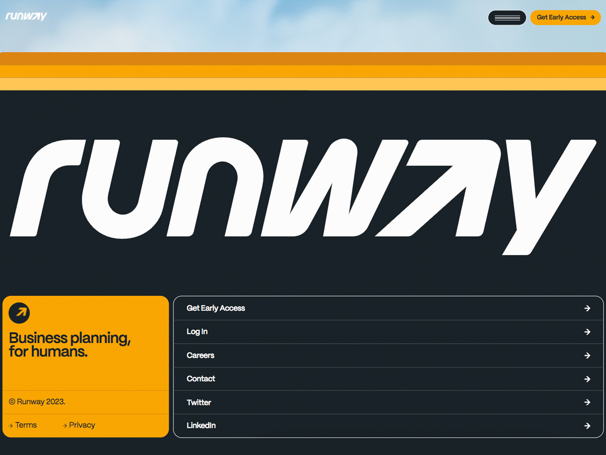

<section class="article-section">

### Before We Begin

Here is a quick update on this project as a whole; it's objectives, design process, juggling it's different divergent processes, and *why* my blog is embedded within the project (and how this has been a challenge!).

#### Project objective

This project's primary challenge revolves around infusing individuality and uniqueness while maintaining a professional and credible portfolio. This portfolio isn’t just a showcase; it's a representation of my skills in web development and design. Striking a balance where creativity meets credibility is the ultimate goal.

#### Research and design process

To tackle this, I’ve dived deep into research, scanning various portfolio websites for inspiration. Consolidating previous notes and research on proper design has been crucial. Embracing an iterative, circular design process allows for constant refinement and improvement. The footer section for my site is inspired off of .

#### Managing a Divergent Process

However, maintaining this structured process faced a snag. [Image: Visualizing the iterative design cycle.] The need for a blog page to share updates disrupted the flow. Developing the blog page while continuing the base development split the project into two streams. One focused on core development, while the other centered on the blog page—a divergence challenging the project's coherence.

#### Intention Behind Blog Integration

I could have hosted updates elsewhere, like other students do. But my vision was different—I wanted these updates to be part of the site itself. [Image: Illustrating the integration of blog updates within the site.] The posts embedded within the project's environment add depth and tangibility, providing a richer experience for visitors to engage with my work.

</section>

<section class="article-section">

### Developing Designs

</section>